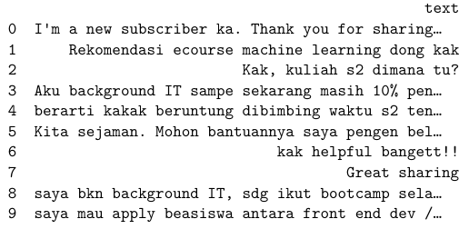

# YoutubeCommentScrape_Analysis

Created python code to scrape youtube comments and do wordcloud analysis based on the comments data scraped from youtube.

## Youtube comment scraping result

## Wordcloud

Pada hasil wordcloud yang sudah menghapus stopword tambahan, lebih banyak insight yang bisa didapatkan, seperti kata “data” yang sangat berkaitan erat dengan materi machine learning, lalu “belajar” yang dapat diartikan sebagai banyaknya audiens youtube yang tertarik untuk pembelajaran machine learning, hal ini dapat menjadi peluang bisnis yang bagus seperti membuat bootcamp, konten-konten singkat di sosial media, dan bisnis edukasi lainnya.

 
